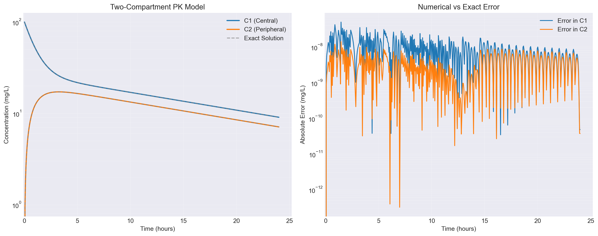
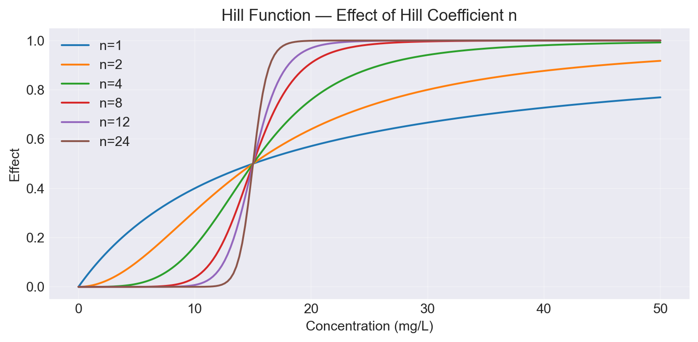
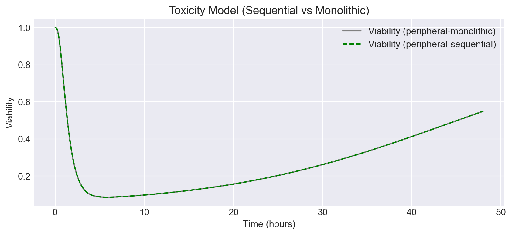
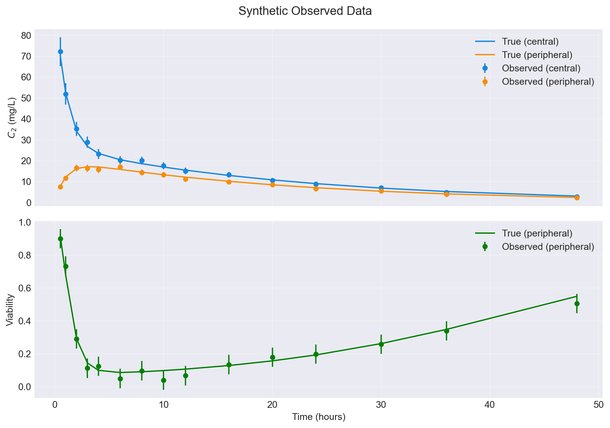
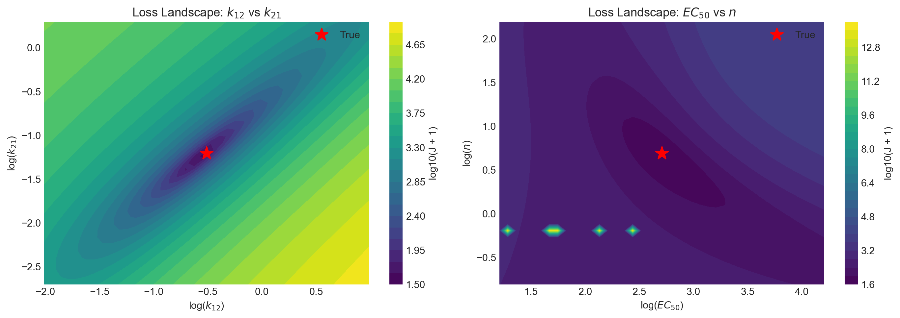
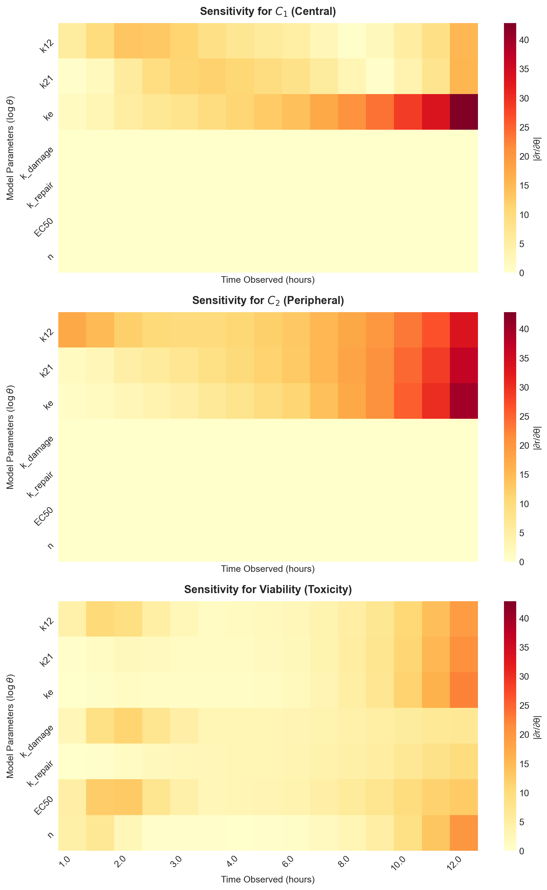
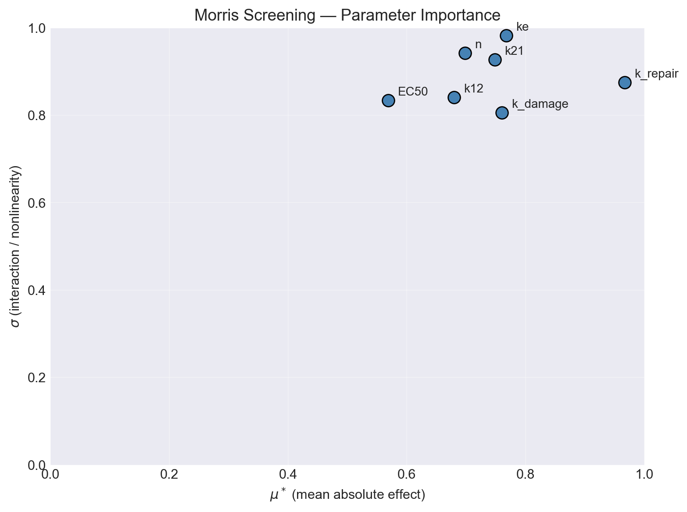
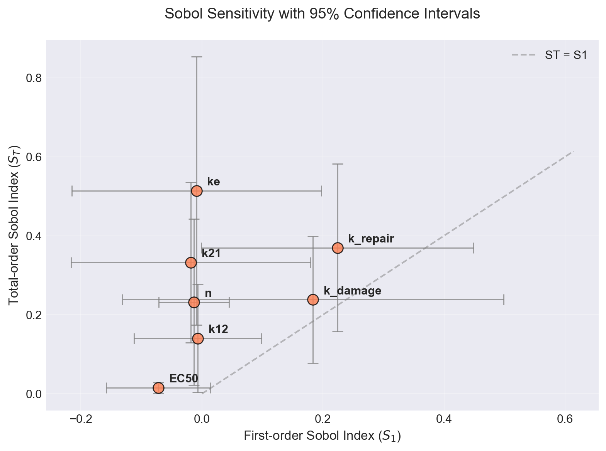
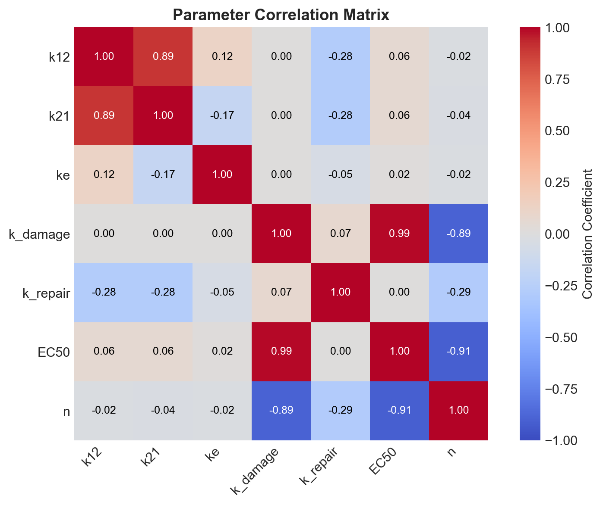
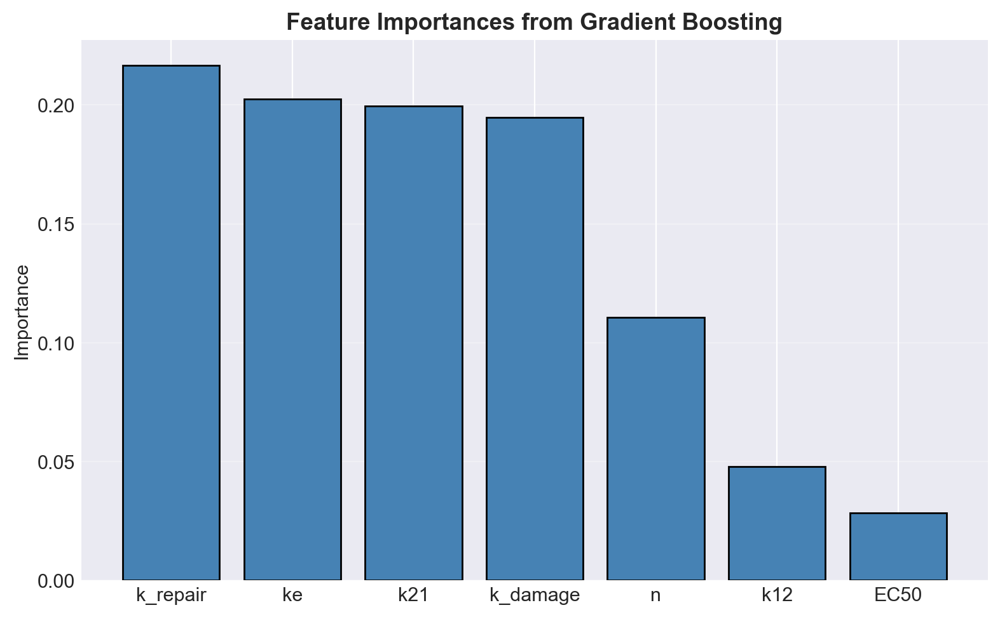

# Organ-on-Chip Onboarding Task

## Purpose

This notebook establishes the core computational toolkit for parameter estimation in mechanistic pharmacokinetic–toxicity (PK-tox) models, motivated by organ-on-chip assays. The broader context is organ-on-chip systems where drugs flow between tissue compartments and cause cell damage. The core skill is recovering model parameters from sparse, noisy measurements—a structured inverse problem.

---

## Objectives

1. **Implement the two-compartment PK model** (central blood + peripheral tissue) and validate numerical integration against the analytical solution.
2. **Extend to a coupled PK-toxicity system** by adding a Hill-function–driven damage ODE; compare monolithic vs. sequential (loosely-coupled) solver strategies.
3. **Formulate the inverse problem** — construct a weighted least-squares objective over synthetic observations and solve it with local and global optimizers.
4. **Characterise the loss landscape** through 2D slices to identify non-convexity and parameter compensation.
5. **Perform multi-method sensitivity analysis** (local Jacobian, Morris elementary effects, Sobol variance decomposition) to rank parameter importance.
6. **Assess identifiability** via the Fisher Information Matrix (FIM): compute standard errors, detect correlations, and classify parameters as identifiable or poorly-determined.

---

## Model

### Two-Compartment Pharmacokinetics

$$\frac{dC_1}{dt} = -(k_{12} + k_e)\,C_1 + \frac{V_2}{V_1}\,k_{21}\,C_2, \qquad
\frac{dC_2}{dt} = \frac{V_1}{V_2}\,k_{12}\,C_1 - k_{21}\,C_2$$

An IV bolus $D = 1000\ \text{mg}$ initialises $C_1(0) = D/V_1$, $C_2(0)=0$.

### Coupled Toxicity

$$\frac{dD}{dt} = k_\text{damage}\cdot f(C_2)\cdot(1-D) - k_\text{repair}\cdot D, \qquad
f(C) = E_\text{max}\,\frac{C^n}{EC_{50}^n + C^n}$$

Cell viability $= 1 - D$. The Hill function $f$ creates a sigmoidal concentration–effect relationship whose shape is controlled by $EC_{50}$ and $n$.

| Parameter | Reference value | Meaning |
|-----------|:-:|---------|
| $k_{12}$ | 0.6 h⁻¹ | Central → peripheral transfer |
| $k_{21}$ | 0.3 h⁻¹ | Peripheral → central back-transfer |
| $k_e$ | 0.15 h⁻¹ | Elimination (hepatic/renal) |
| $k_\text{damage}$ | 2.0 h⁻¹ | Toxicity induction rate |
| $k_\text{repair}$ | 0.1 h⁻¹ | Cell repair/recovery rate |
| $EC_{50}$ | 15.0 mg/L | Concentration at half-maximal effect |
| $n$ | 2.0 — | Hill coefficient |

---

## Results

### Forward Model

>C₁ and $C_2$ over 48 h; inset shows Radau solver vs. analytical solution error < 10⁻⁶, confirming solver accuracy.

>Hill curves for $n$ ∈ {1, 2, 4, 8, 12, 24}: steeper sigmoidal transitions with increasing n, all anchored at $EC_{50}$ = 15 mg/L.

>Coupled PK-tox trajectories. Viability reaches a minimum near the $C_2$ peak (~3–4 h) then recovers as elimination reduces drug load. Monolithic and sequential solvers agree to within 2×10⁻⁴ since this is a one-way system. In a two way system, one where $C_1$ and $C_2$ are dependent on $D$, we would expect the two methods to differ.

### Inverse Problem — Optimisation

#### Generating Synthetic Data

45 synthetic observations (15 time points × 3 outputs $C_1$, $C_2$ and $V$): added 5% relative noise on C₁ and $C_2$ and 3% absolute noise on viability.

#### Parameter Estimation
Parameters were estimated in log-space (log θ) to enforce positivity and regularise scale differences. The objective is the weighted sum of squared residuals:

$$J(\boldsymbol{\theta}) = \sum_{i=1}^{45}\left(\frac{y_i^\text{obs} - y_i^\text{model}(\boldsymbol{\theta})}{\sigma_i}\right)^2$$

| Method | Good init | Bad init | Speed | Notes |
|--------|:---:|:---:|:---:|-------|
| L-BFGS-B | ✓ | × | Fast | Fails within ~×2 of truth |
| Levenberg–Marquardt | ✓ | × | Very Fast | Exploits SSQ structure |
| Differential Evolution | — | — | Slow | Robust global search |
| Multi-start (n=20) | — | — | Moderate | Most random starts trapped in local minima |

>The loss landscape is strongly non-convex with **multiple basins of attraction**, not just a single local minimum. The root cause is parameter compensation: $EC_{50}$ and $n$ are nearly interchangeable (ρ ≈ 0.95), and $k_{damage}$ and $k_repair$ trade off (ρ ≈ 0.90), creating families of parameter sets that produce indistinguishable observations (see landscape plot below). This means multi-start's ~50% success rate is not just unlucky initialisation—it reflects a genuinely multi-modal objective.

>**Best practice**: use Differential Evolution for global exploration, then polish the best result with L-BFGS-B or Levenberg–Marquardt.

### Loss Landscape

>2D slices at the true parameter values. Left: log $k_{12}$ vs log $k_{21}$ — an elongated valley reflecting mass-conservation trade-offs (ρ = 0.89). Right: log $EC_{50}$ vs log $n$ — nearly flat ridge (ρ = −0.91), revealing that the Hill curve shape can be replicated by compensating pairs.

### Sensitivity Analysis

> Local Jacobian |∂r/∂θ|: C₁ and $C_2$ are sensitive only to $k_{12}$, $k_{21}$, and $k_e$ — the PK parameters that compose their ODEs. $k_e$ dominates C₁ at late times (terminal elimination slope). $C_2$ is approximately equally influenced by all three PK parameters, with sensitivity growing at later times. Viability is weakly sensitive to all seven parameters: directly through $k_{damage}$, $k_{repair}$, $EC_{50}$, and $n$, and indirectly through $k_{12}$, $k_{21}$, and $k_e$ via their effect on the $C_2$ input to the damage equation.

> Morris μ\*–σ plot: all parameters have significant mean effect (μ\*) and interaction (σ), confirming a highly non-linear landscape throughout parameter space. $k_{repair}$ is the most influential and $k_e$ the most correlated (highest σ/μ\* ratio). $k_{12}$ and $EC_{50}$ have the lowest overall influence and are the **safest candidates to fix at approximate literature values**, reducing dimensionality with minimal accuracy loss. Future experiments should prioritise measurements that constrain $k_{repair}$ and $k_e$.

>First-order ($S_{1}$) vs. total-order ($S_{t}$) Sobol indices. $S_{1}$ captures a parameter's isolated contribution to output variance; $S_{t}$ includes coupling effects, so $S_{t}$ − $S_{1}$ measures interaction-only influence. Points on the dashed $S_{1}$ = $S_{t}$ line have purely direct effects. Note: with only 50 samples (a computational choice for this exercise), confidence intervals are wide and the values should not be over-interpreted. Qualitatively: $k_{repair}$ is the dominant parameter (~24% individual contribution), consistent with Morris. $k_e$ has large coupling influence but negligible direct effect. $k_{12}$ and $EC_{50}$ have the lowest total influence, corroborating Morris — both are safe to fix in a reduced model.

### Identifiability — Fisher Information Matrix

>FIM-derived correlation matrix. High correlation (positive or negative) means the model cannot distinguish between two parameters because they compensate for one another — these are the under-determined parameters. Three pairs exceed |ρ| = 0.89.

| Parameter | CV (%) | Identifiable? | Notes |
|-----------|:------:|:-------------:|-------|
| $k_{12}$ | ~30 | Yes | Well-constrained by early $C_2$ rise |
| $k_{21}$ | ~25 | Yes | Coupled with $k_{12}$ but resolvable |
| $k_e$ | ~20 | Yes | Dominates terminal elimination slope |
| $k_\text{damage}$ | ~50 | Borderline | Strongly coupled with $EC_{50}$ and $n$ |
| $k_\text{repair}$ | ~35 | Yes | Uniquely controls recovery slope |
| $EC_{50}$ | >80 | **No** | Near-perfect collinearity with $k_\text{damage}$ and $n$ |
| $n$ | >90 | **No** | Near-perfect collinearity with $k_\text{damage}$ and $EC_{50}$ |

>**Correlated pairs and their physical cause:**
>- **($k_{12}$, $k_{21}$) — ρ = 0.89**: both govern inter-compartment transfer and are coupled by mass conservation. Increasing $k_{12}$ can be partially offset by increasing $k_{21}$. *Fix*: denser sampling of the early $C_2$ rise to distinguish forward and back-transfer rates.
>- **(EC₅₀, k_damage, n) — |ρ| up to 0.99**: when $C \ll EC_{50}$, the Hill term simplifies to ${\approx}\,k_\text{damage}\,C^n / EC_{50}^n$, so the model fits the ratio $k_\text{damage}/EC_{50}^n$ rather than the three parameters individually. These three show the largest estimation errors. *Fix*: add observations at concentrations spanning the EC₅₀ to resolve the Hill function's steepness and midpoint independently.

### Machine Learning Surrogate Models

500 parameter sets were drawn via Latin Hypercube Sampling over log-space bounds [-2.5, 2.5]; 425 produced valid ODE solutions (85%). Three outputs were extracted per sample: max $C_1$, max $C_2$, and final viability at $t = 48$ h. Two surrogates were trained on an 80/20 split to predict these outputs from the 7 log-parameters:

| Model | R² | RMSE |
|-------|:---:|:---:|
| Gradient Boosting (GBR) | 0.553 | 0.207 |
| MLP (128, 64) | 0.829 | 0.128 |

#### Feature Importance (GBR)

$k_\text{damage}$ and $EC_{50}$ are the dominant predictors of final viability, followed by $n$ and $k_\text{repair}$. The PK parameters ($k_{12}$, $k_{21}$, $k_e$) rank lowest — they determine drug *exposure*, but final cell fate is governed by the damage-repair balance. This hierarchy is consistent with the Morris and Sobol analyses that predicts these dominant parameters as the most under-determined.

#### Computational Speedup

| Approach | Per evaluation | Speedup | Loss |
|----------|:---:|:---:|:---:|
| ODE solver | ~2,800 ms | — | 3.9341 |
| MLP surrogate | ~18.5 ms | ~154× |  0.06|

The lower MLP loss indicates that the MLP model is able to navigate the non-linear parameter space more intelligently than iterative solvers.

---

## Key Learnings

- **Sequential vs. monolithic coupling** is equivalent for this one-way system — sequential coupling with ODE interpolation is simpler to extend to multi-organ networks.

- **Non-convex optimisation** is unavoidable in PK-tox systems due to parameter coupling; problems can be small enough to allow for global search, although this does not scale nicely. A local polish (LM / L-BFGS-B) after a good starting point is far more efficient.

- **The FIM provides a cheap identifiability screen** before running expensive MCMC or ensemble methods; condition number and off-diagonal correlations directly diagnose structural problems and provide intuitive experimental improvements.

- **Sensitivity analysis methods agree qualitatively** but serve different roles: Jacobian gives local, per-output information; Morris is efficient for ranking; Sobol provides interaction structure at higher cost.

- **Surrogate Machine Learning models** can offer a fantastic speed up to ODE computation and better capture the non-linear relationship between parameters to give more accurate solutions.

---

## FWI vs. Two-Compartment PK — Problem Comparison

| Aspect | Full Waveform Inversion (FWI) | Two-Compartment PK + Toxicity |
|--------|-------------------------------|-------------------------------|
| **Governing equations (forward)** | Acoustic / elastic wave PDE (second-order in space and time) | System of 3 coupled first-order ODEs |
| **Forward solver** | Finite-difference / spectral-element time-stepping | Implicit Runge–Kutta (Radau); optional sequential ODE split |
| **Observations** | Seismograms/ultrasound (pressure / velocity time-series at receivers) | Concentration and viability at discrete blood-draw time points |
| **Inversion scale** | O(10⁶–10⁹) spatial model parameters (velocity field, density) | 7 scalar rate/PD parameters |
| **Optimisation technique** | Gradient-based (L-BFGS, Adam) via adjoint-state method | L-BFGS-B; Levenberg–Marquardt; Differential Evolution; multi-start |
| **Gradient computation** | Adjoint PDE solve (same cost as forward) | Automatic differentiation or finite-difference Jacobian |
| **Cause of ill-posedness** | Band-limited data (missing low frequencies), cycle-skipping, limited aperture, non-unique velocity–density trade-off | Parameter collinearity in Hill function ($EC_{50}$ – $n$ – $k_{damage}$); sparse temporal sampling at a single dose level |
| **Under-determined parameters** | Short-wavelength (high-frequency) velocity heterogeneities; density when only pressure recorded | $EC_{50}$ and Hill coefficient $n$ (cannot be independently resolved from single-dose viability data) |
| **Over-determined parameters** | Long-wavelength velocity trend (if low frequencies present and good initial model) | $k_{12}$, $k_{21}$, $k_e $(redundantly constrained by multi-point concentration time-series); $k_repair$ (unique signature in recovery tail) |
| **Regularisation** | Tikhonov / TV on velocity field; multi-scale frequency continuation | Log-space parameterisation; fixing literature-constrained parameters ($V_1$ , $V_2$ , $E_{max}$) |
| **Identifiability diagnostic** | Bayesian FWI | Fisher Information Matrix — condition number, covariance, CV% |
| **Analogy** | Recovering Earth's interior from surface wave arrivals | Recovering drug kinetics and cell damage parameters from blood/viability assays |
